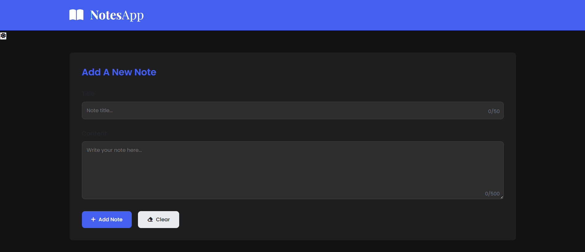
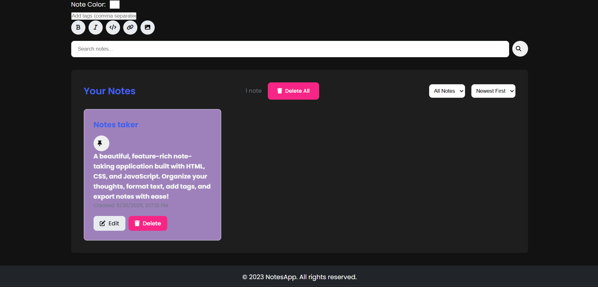

# notes-taking-app

📸 Screenshot

✨ Features

Rich Text Formatting - Bold, italic, code blocks, links, and images

Tags & Organization - Categorize notes with tags

Dark/Light Mode - Eye-friendly themes

Search & Filter - Find notes quickly

Responsive Design - Works on all devices

Local Storage - Notes are saved in your browser

🚀 Getting Started

1. Clone the repo
2. Open in browser

    Simply open index.html in your favorite browser

🛠️ Built With

HTML5

CSS3 (Flexbox, Grid, Variables)

Vanilla JavaScript

FontAwesome - Icons

highlight.js - Code syntax highlighting

💡 Usage Tips

Quick Add Note: Ctrl/Cmd + Enter in the content area

Markdown Support: Uses simple markdown syntax for formatting

Pin Important Notes: Keep frequently used notes at the top

📸 Screenshot

🌟 Upcoming Features

Cloud sync

Note categories/folders

Image uploads

Mobile app version
📸 Screenshot

